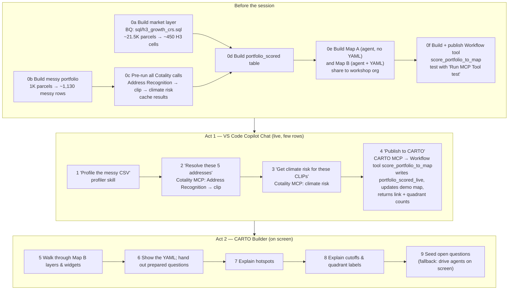
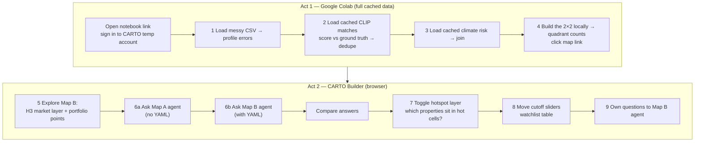

# Workshop workflow (sketch)

60-minute hands-on session: **Real-estate portfolio screening — growth × climate risk**, Lee County, FL.
Data design and assumptions: [part1_data_workflow.md](part1_data_workflow.md).

**Shape of the session**

- **Act 1 — Clean & enrich (~20 min).** For each step the presenter shows an AI agent doing it live on a
  few rows (VS Code Copilot Chat + MCP servers); the audience then runs the same step on the full cached
  data in Colab.
- **Act 2 — Explore & decide (~33 min).** Everyone opens shared CARTO Builder maps with AI agents: compares
  answers with and without the semantic model (YAML), explores hotspots and the growth × risk 2×2.

## Environments

| | Presenter | Audience |
|---|---|---|
| Act 1 | VS Code + GitHub Copilot Chat (agent mode, Claude model), workshop repo open, MCP servers in `.vscode/mcp.json`: **Cotality MCP**, **CARTO MCP** | **Google Colab** notebook (browser, Google account) |
| Act 2 | CARTO Builder (browser) | CARTO Builder (browser, **CARTO temp account**) |
| Credentials | Cotality API/MCP, CARTO (OAuth), Copilot licence | Google account + CARTO temp account only |

## Presenter flow



## Audience flow



Maps A and B are pre-built and shared to the workshop org. Each attendee gets their own view: sliders,
filters and agent chats are per person and do not affect anyone else.

## Step table

| # | Time | Presenter | Audience | Result | Tool access |
|---|---|---|---|---|---|
| — | 0:00–0:05 | Intro: the business problem, the stack (trusted data + MCP + semantic model + CARTO) | Open Colab link, sign in to CARTO | Everyone set up | Audience: Google account, CARTO temp account |
| 1 | 0:05–0:10 | Copilot Chat: "Profile the messy CSV" → profiler skill | Colab: load CSV, run profiling cell | ~60% of rows messy; duplicates found | P: VS Code Copilot + repo skill. A: Colab (CSV from repo) |
| 2 | 0:10–0:15 | Copilot Chat: resolve 5 addresses via Cotality MCP (Address Recognition → clip) | Colab: load cached matches for ~1,130 rows, compare with ground truth, dedupe | Match rate by error type; ~1,000 unique CLIPs | P: **Cotality MCP**. A: cached results (via CARTO login) |
| 3 | 0:15–0:20 | Copilot Chat: climate risk for 1–2 CLIPs via Cotality MCP | Colab: load cached risk, join to portfolio | Risk per property | P: **Cotality MCP**. A: cached results |
| 4 | 0:20–0:25 | Copilot Chat: "Publish to CARTO" → agent calls Workflow tool `score_portfolio_to_map` via CARTO MCP → writes `portfolio_scored_live`, updates the demo map, returns link + quadrant counts | Colab: build 2×2 locally, see quadrant counts; click map link | Handoff to CARTO | P: **CARTO MCP** (OAuth) + published Workflow tool. A: Colab |
| 5 | 0:25–0:30 | Walk through Map B: H3 bivariate layer, portfolio points, widgets | Open Map B, toggle layers, click popups | Market vs *my* portfolio on one map | Both: CARTO Builder |
| 6 | 0:30–0:40 | Show YAML (grain, metrics, join key, risk meaning); hand out 2–3 questions | Ask the same question to Map A and Map B agents; compare | Semantic model → correct, repeatable answers | A: **Builder AI agent** (viewer access TBC) |
| 7 | 0:40–0:44 | Explain hotspots (significant clusters, not raw counts) | Toggle pre-computed hotspot layer; filter to hot cells | Where growth is really concentrated | Both: Builder layers (no AI) |
| 8 | 0:44–0:50 | Explain cutoffs and labels: Pursue / Watchlist / Hold / Reassess | Move growth and risk sliders; watch counts; open watchlist table | **Watchlist**: growth meets high risk | Both: Builder parameters + widgets (no AI) |
| 9 | 0:50–0:55 | Seed prompts, e.g. "Which Pursue properties sit in hotspot cells?" | Ask Map B agent own questions | Open-ended Q&A grounded by the YAML | A: **Builder AI agent** |
| — | 0:55–0:58 | Recap; repo link | Take repo link | Can redo it at home | — |

## Step 4 — how "Publish to CARTO" works

The CARTO MCP server offers two ways for the agent to write the table and produce a map.

| | **A. Built-in tools** (`execute_async_query` + `create_map` + `update_map`) | **B. Published Workflow tool** (`score_portfolio_to_map`) |
|---|---|---|
| What the agent does | Several calls: writes SQL, builds the whole map definition (datasets, layers, widgets), publishes | One call with inputs we define (`run_label`, `growth_cutoff`, `risk_cutoff`) |
| Who can call it (OAuth role) | Admin, Editor | Admin, Editor, **Viewer** |
| Map styling | Re-generated by the agent each time, so it varies | `Create Builder Map` component in **Update** mode keeps our pre-built styles and widgets |
| Predictability on stage | Lower: the agent can improvise | High: logic pinned to the published version |
| Prep effort | None | Build Workflow, write tool description, `Run MCP Tool test`, publish; re-sync after edits |
| Caching | None | "Reuse output for repeated calls" for identical inputs |
| Callable by the Builder AI agent (Act 2) | No | Yes (org Workflow tools can be added to Builder agents) |
| Many attendees at once | Not applicable | Output collisions unless a per-user input + `Create a copy` mode is used |
| Cotality API calls inside it | — | Impractical: `HTTP Request` component is capped at 10 rows, so inputs are the cached tables |
| Message to the audience | "An agent can build CARTO maps" | "Governed logic packaged as a tool any agent can call", same story as the Cotality MCP |

**Decision (draft): lean on B, keep A as backup.**

- **B** is the step-4 path: predictable on stage, reusable by the Builder agent in Act 2, and callable by
  attendees if the temp accounts turn out to be Viewers.
- **A** is for improvised follow-ups by the presenter ("add a layer of Watchlist properties only") and is the
  fallback if the Workflow tool fails.

**Sketch of `score_portfolio_to_map`** (built in Workflows on the BigQuery connection):

```
portfolio_enriched (cached: CLIP, lat/lon, h3, risk_score)  ─┐
carto_sdsc_h3_r9 (market layer: k1_growth_share, hotspot)  ──┴─► Join on h3
  ─► classify quadrant (growth_cutoff, risk_cutoff; defaults = study-area medians)
  ─► Save as Table: portfolio_scored_{run_label}
  ─► Create Builder Map (mode: Update, map "SDSC live demo")
  ─► MCP Tool Output (Sync): map URL + counts per quadrant
```

Inputs the agent may pass: `run_label` (string, default `live`), `growth_cutoff` (number), `risk_cutoff`
(number). Because the cutoffs are inputs, a follow-up such as "republish with a risk cutoff of 70" is one
tool call.

## Notebooks

| Notebook | Who | Runs where | Purpose |
|---|---|---|---|
| [`scripts/notebooks/presenter_runbook.ipynb`](../scripts/notebooks/presenter_runbook.ipynb) | Presenter | VS Code, next to Copilot Chat | Pre-flight checks, prep steps 0a–0f, the exact Copilot Chat prompt for each live step, expected tool calls, talking points, and a fallback cell that loads cached results |
| [`scripts/notebooks/audience_act1.ipynb`](../scripts/notebooks/audience_act1.ipynb) | Audience | Google Colab | Steps 1–4 on the full cached data, ending with the 2×2 and the links to Maps A and B |

Both run end to end on **synthetic data** (`DATA_MODE = "synthetic"`) with the same schemas as the real
cached tables, so the flow can be rehearsed before the real data and approvals exist. Switching to
`DATA_MODE = "carto"` loads the real tables once the loading route (open question below) is settled.

**Fallbacks**

- Cotality MCP or network fails in steps 2–3 → presenter loads the same cached results as the audience.
- Workflow tool fails in step 4 → agent falls back to built-in tools (`execute_async_query` + `create_map`);
  if CARTO MCP is down → skip to the pre-built Map B.
- AI usage / concurrency limits in steps 6 and 9 → presenter drives the agents on screen with pre-recorded
  answers; steps 5, 7 and 8 need no AI and stay hands-on.
- Over time → trim steps 7 and 9.

## Open questions

| Question | Owner | Affects |
|---|---|---|
| Can temp-account viewers use a map's AI agent? AI usage and concurrency limits for ~N attendees? | CARTO | Steps 6, 9 |
| One agent per map (so two maps for A/B)? | CARTO | Step 6 |
| Can the agent's semantic model be set via CARTO MCP/CLI, or only in the Builder UI? | CARTO | Prep 0e |
| How does Colab read cached data behind a CARTO login (not a public file)? | CARTO | Act 1 |
| Cotality MCP: hosted URL or local, auth, rate limits for ~3,300 prep calls? | Cotality | Prep 0c, steps 2–3 |
| Does Copilot in VS Code support repo skill files, or do we use prompt files? | Us | Step 1 |
| Leadership approval to expose H3 aggregates + ~1K portfolio addresses? | Cotality leadership | Everything |
| Temp accounts: Viewer or Editor role? (Viewers can call published Workflow tools but not `create_map`) | CARTO | Step 4, optional audience publish |
| Concurrency limits on published Workflow tools; can "Create a copy" give one map per attendee? | CARTO | Step 4 (audience variant) |
| Can a Workflow `Save as Table` name use a variable (e.g. `portfolio_scored_{run_label}`)? | CARTO | Prep 0f |
| Does `create_map`'s optional agent config accept the semantic model (YAML)? | CARTO | Prep 0e |
